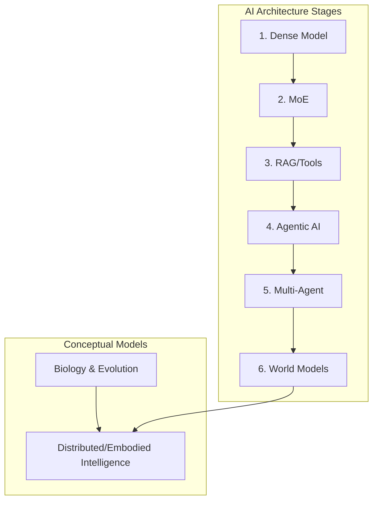

# The Architecture of Intelligence

## Biological & Artificial Evolution

Welcome to the **Architecture of Intelligence** repository. 

This project explores the profound paradigm shift in how we understand intelligence. Early assumptions in AI posited that a bigger brain or a larger model equaled greater intelligence. However, modern research reveals that intelligence is a dynamic, distributed system interacting with its environment, tools, and memory.

By mapping modern neuroscience, systems theory, and biological evolution to the current AI landscape (2024–2026), we can see that AI is not just scaling up—it is evolving in stages strikingly similar to natural life. It moves from Dense to Mixture of Experts (MoE), to Agentic, Multi-Agent, and eventually massive Ecosystem-level intelligence arrays.

## System Map

## 📂 Documentation Directory

Please navigate through the [docs/](docs/) folder to explore the detailed concepts:

### 1. Fundamentals
- [Overview](docs/01_Overview.md) - Explores how human intelligence is modular, layered, and fundamentally distributed.
- [The Intelligence Model](docs/02_Intelligence_Model.md) - Specialized regions vs the unified mind.
- [Biological Intelligence](docs/03_Biological_Intelligence.md) - DNA, evolution, and slow learning.

### 2. The AI Landscape
- [AI Model Evolution](docs/04_AI_Model_Evolution.md) - A breakdown of the multiple evolutionary branches of AI, from Dense Transformers to World Models.
- [Architecture Stages](docs/05_Architecture_Stages.md) - A step-by-step framework showing how AI architecture is moving from "single-cell" models to "ecosystem" intelligence.

### 3. Advanced Concepts
- [Distributed Intelligence](docs/06_Distributed_Intelligence.md) - The illusion of a centralized brain.
- [Agentic & Multi-Agent Systems](docs/07_Agentic_and_MultiAgent.md) - Goal-driven autonomy and social intelligence.
- [World Models](docs/08_World_Models.md) - Simulating future outcomes and environmental prediction.
- [Ecosystem Intelligence](docs/09_Ecosystem_Intelligence.md) - Why intelligence naturally evolves toward networks.

### Reference Tables
- [Model Comparison Map](docs/tables/model_comparison.md)
- [Evolution Map](docs/tables/evolution_table.md)
- [Architecture Focus Table](docs/tables/architecture_table.md)
