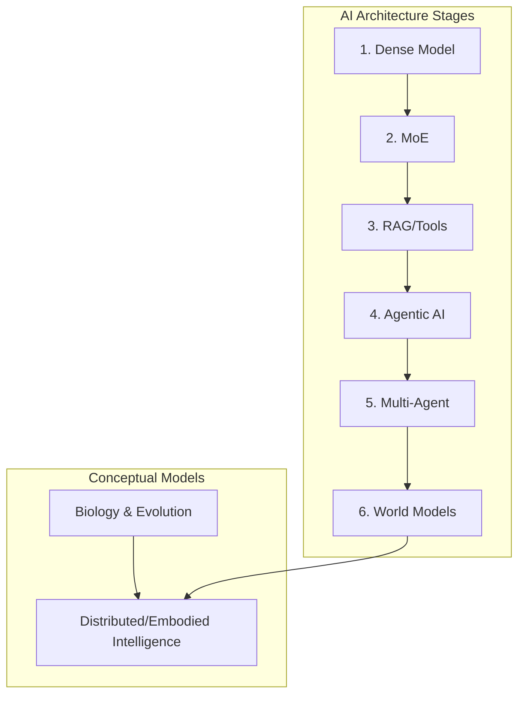

🧠 IntelliGenesis
# The Architecture of Intelligence: Biological & Artificial Evolution

Welcome to the **Architecture of Intelligence** repository.

This project outlines the fundamental paradigm shift occurring in our understanding of intelligence. For decades, early AI assumptions posited that a "bigger brain" or a larger model natively equaled greater intelligence. However, modern research reveals that true intelligence is not a singular, localized object but a **dynamic system interacting with its memory, tools, and environment**.

By mapping modern neuroscience and biological evolution to the current AI landscape of 2024–2026, we can clearly see that artificial intelligence is evolving in stages strikingly identical to natural life. It moves from Dense to Mixture of Experts (MoE), to Agentic, Multi-Agent, and eventually massive Ecosystem-level intelligence arrays.

---

## 🌍 The Core Philosophy

### 1. The Modular, Unified Mind
Modern neuroscience suggests human intelligence relies on specialized subsystems (the visual cortex for seeing, the hippocampus for memory) while simultaneously producing a unified sense of "self." This architectural tension directly mirrors the ongoing AI transition from **Dense networks** (one massive brain) to **Mixture of Experts (MoE)** models (specialized routing for energy efficiency).

### 2. Distributed and Embodied Intelligence
Intelligence is not located exclusively inside an individual computing unit. It is an emergent property created by interaction. In biology, learning requires observation, social transmission, physical interaction, and time. In AI, this equates to the equation: 
> `Intelligence = System + Environment + Tools + Memory + Feedback`

### 3. Biology vs. Artificial Intelligence
Life itself is a long-running learning algorithm. DNA acts as compressed survival memory, passing down inherited prior solutions. We can map this directly to AI development mechanisms:

| Biology Concept | AI Equivalent | Core Mechanism |
|---|---|---|
| **DNA** | Model Weights | Deep, inherited structural logic |
| **Evolution** | Training Process | Slow learning across massive time/data scales |
| **Experience** | Fine-Tuning | Rapid adaptation through specific interaction |
| **Culture** | External Memory (RAG) / Internet | Shared, distributed evolutionary knowledge |

---

## 🏗️ The 6 Evolutionary Stages of AI Architecture

AI's progression is no longer just about scaling parameters; it is about building organized, collaborative ecosystem intelligence. This evolution mimics biological life:

| Stage | Biological Analogy | AI Equivalent | Core Concept |
| :--- | :--- | :--- | :--- |
| **Stage 1** | Single-Cell Organism | **Dense Models** (Early GPT) | Unified, simple, but energy-inefficient at scale. |
| **Stage 2** | Specialized Organs | **MoE Models** (Mixtral) | Division of labor for massive energy efficiency. |
| **Stage 3** | Tool-Using Humans | **RAG + Tools** | Utilizing external APIs, calculators, and memory stores. |
| **Stage 4** | Goal-Driven Individual | **Agentic AI** | Autonomy via loops: *Plan → Act → Observe → Iterate*. |
| **Stage 5** | Human Society | **Multi-Agent Systems** | Roles (Coder, Critic, Planner), debate, and collective intelligence. |
| **Stage 6** | Ecosystem | **World Models** | Predictive simulation of the environment before acting. |

---

## 🗺️ System Map

---

## 📂 Documentation Directory

To explore these concepts deeply, please navigate through the detailed, modular architecture in our `docs/` folder:

### Part 1: Foundations of Intelligence
- [01_Overview.md](docs/01_Overview.md) - How intelligence is modular, layered, and fundamentally distributed.
- [02_Intelligence_Model.md](docs/02_Intelligence_Model.md) - Specialized biological regions vs the unified MoE/Dense mind.
- [03_Biological_Intelligence.md](docs/03_Biological_Intelligence.md) - DNA, evolution, and learning beyond computation.

### Part 2: The AI Landscape
- [04_AI_Model_Evolution.md](docs/04_AI_Model_Evolution.md) - The multiple evolutionary branches of AI (SLMs, Multimodals, World Models).
- [05_Architecture_Stages.md](docs/05_Architecture_Stages.md) - The step-by-step framework transitioning from "single-cell" models to "ecosystem" intelligence.

### Part 3: Advanced Concepts
- [06_Distributed_Intelligence.md](docs/06_Distributed_Intelligence.md) - The illusion of a centralized brain and systems theory.
- [07_Agentic_and_MultiAgent.md](docs/07_Agentic_and_MultiAgent.md) - Goal-driven autonomy replacing "Ask → Answer".
- [08_World_Models.md](docs/08_World_Models.md) - Simulating future outcomes and anticipating environmental behavior.
- [09_Ecosystem_Intelligence.md](docs/09_Ecosystem_Intelligence.md) - Why intelligence naturally gravitates toward networks as the ultimate civilized ecosystem.

### Reference Tables
- [Model Comparison Map](docs/tables/model_comparison.md)
- [Evolution Map](docs/tables/evolution_table.md)
- [Architecture Focus Table](docs/tables/architecture_table.md)

---
*The ultimate realization is that civilization itself is a giant multi-agent system, and AI naturally aims toward becoming a diverse, networked ecosystem rather than a monolithic super-brain.*
