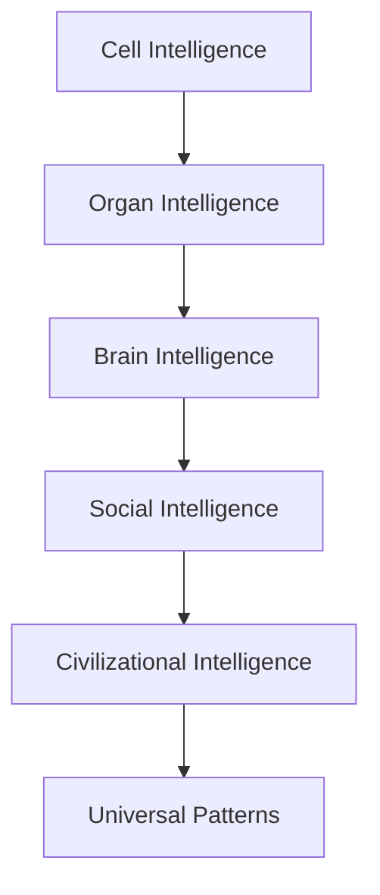

# Overview

This document serves as the foundational starting point for understanding the nature of intelligence, both in biological systems and artificial architectures.

> **Note**: This is the first stage in our exploration of how intelligence models are evolving.

## The Nature of Intelligence

Human intelligence is **not** a single, monolithic entity. According to modern neuroscience, human intelligence is both specialized in its subsystems and unified in its experience. 

Intelligence exists at many scales. It forms a holistic model moving from simple biological blocks to complex universal patterns.

### The Intelligence Hierarchy

Intelligence is distributed across the following layers:

### Key Insights

1. **Cells make local decisions.**
2. **Organs coordinate functions.**
3. **The Brain integrates signals.**
4. **Social groups create shared intelligence.**
5. **Culture stores memory across generations.**

Intelligence is process, not an object. It emerges where information, adaptation, and feedback exist. The central premise is that **intelligence is distributed**—it spans far beyond individual capability and branches into environmental and societal domains.

---

**Next:** [02_Intelligence_Model.md](02_Intelligence_Model.md)
