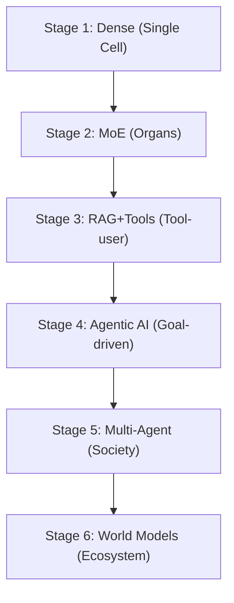

# Evolutionary Stages of AI Architecture

AI development mirrors the evolution from single-cell life to complex organisms within an ecosystem. Understanding this framework makes modern architectures like MoE, agents, and multimodal systems suddenly click together.

## Stage 1 — Single-Cell Intelligence (Early Dense Models)
- **Life Analogy:** A single-cell organism.
- **AI Equivalent:** Dense transformer models.
- **Characteristics:** One giant, simple network where every part works on every task.
- **Limitation:** Energy expensive; doesn’t scale efficiently.

## Stage 2 — Specialized Organs (MoE Models)
- **Life Analogy:** Human body with distinct organs (Heart, Lungs, Brain).
- **AI Equivalent:** Mixture of Experts.
- **Characteristics:** A router chooses specialists for tasks. Instead of one generalist, it functions as a team of experts, drastically saving energy.

## Stage 3 — Tool-Using Humans (Tool-use + RAG)
- **Life Analogy:** Human using books, calculators, or the internet.
- **AI Equivalent:** Retrieval-Augmented Generation (RAG), function calling, APIs.
- **Philosophy:** Intelligence = internal reasoning + external tools. The system does not memorize everything; it learns to look things up.

## Stage 4 — Goal-Driven Individuals (Agentic Systems)
- **Life Analogy:** A project manager.
- **AI Equivalent:** Agent loops involving structured multi-step reasoning.
- **Key Shift:** Overcoming the static "Ask → answer" paradigm to adopt "Goal → plan → act → evaluate → repeat". AI begins *acting*.

## Stage 5 — Social Intelligence (Multi-Agent Systems)
- **Life Analogy:** Human society.
- **AI Equivalent:** Multiple interacting agents: researcher, coder, critic, planner.
- **Insight:** Collective intelligence is vastly superior to individual intelligence. Most frontier AI systems as of 2026 are transitioning from Stage 4 into Stage 5.

## Stage 6 — Ecosystem Intelligence (World Models)
- **Life Analogy:** Animals predicting movements in an environment (a tiger calculating a jump).
- **AI Equivalent:** Internal world models simulating future outcomes.
- **Insight:** Intelligence involves predicting how the world behaves and reacting inside simulations before making a physical move.

For a summary table, see the [AI Evolution Map](tables/evolution_table.md).

---

**Previous:** [04_AI_Model_Evolution.md](04_AI_Model_Evolution.md) | **Next:** [06_Distributed_Intelligence.md](06_Distributed_Intelligence.md)
