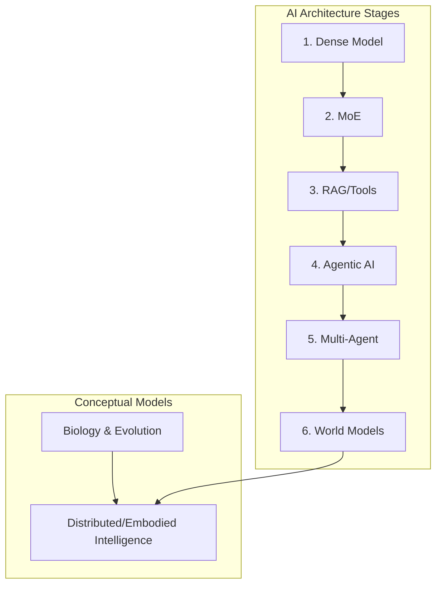

# CommonSense Concept Architecture

## What this document explains
This repository contains a structured, systematic exploration of intelligence, analyzing how biological principles parallel the evolutionary stages of artificial intelligence (AI) models. It translates abstract philosophical and biological concepts into concrete, modular architectural blueprints for advanced AI systems.

## Concept Summary
The core argument is that intelligence is not a single location or super-brain, but rather a dynamic, distributed ecosystem. It progresses from Dense to Mixture of Experts (MoE), to Agentic, Multi-Agent, and eventually massive Ecosystem-level intelligence arrays—mirroring biological evolution from a single cell up to civilizational patterns.

## System Map

## Overview of Stages
- **Stage 1:** Single-Cell (Dense)
- **Stage 2:** Organs (MoE)
- **Stage 3:** Tool-using humans (RAG + Tools)
- **Stage 4:** Goal-driven individuals (Agentic AI)
- **Stage 5:** Society (Multi-agent Systems)
- **Stage 6:** Ecosystem (World Models)

## Table of Contents

### 1. Fundamentals
- [01_Overview.md](01_Overview.md)
- [02_Intelligence_Model.md](02_Intelligence_Model.md)
- [03_Biological_Intelligence.md](03_Biological_Intelligence.md)

### 2. The AI Landscape
- [04_AI_Model_Evolution.md](04_AI_Model_Evolution.md)
- [05_Architecture_Stages.md](05_Architecture_Stages.md)

### 3. Advanced Concepts
- [06_Distributed_Intelligence.md](06_Distributed_Intelligence.md)
- [07_Agentic_and_MultiAgent.md](07_Agentic_and_MultiAgent.md)
- [08_World_Models.md](08_World_Models.md)
- [09_Ecosystem_Intelligence.md](09_Ecosystem_Intelligence.md)

### Reference Tables
- [Model Comparison Map](tables/model_comparison.md)
- [Evolution Map](tables/evolution_table.md)
- [Architecture Focus Table](tables/architecture_table.md)
